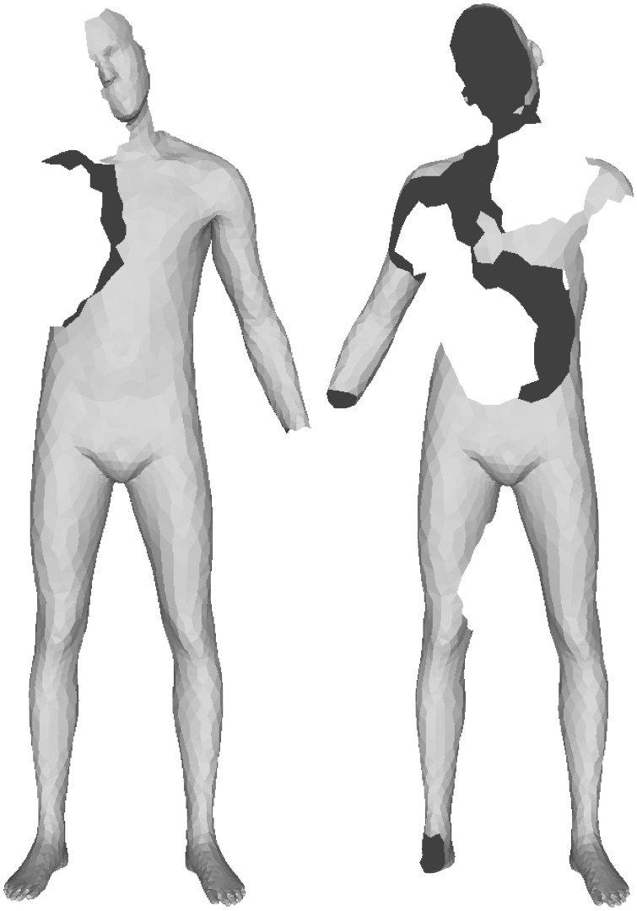

# PFAUST Benchmark

## Overview
The PFAUST benchmark is a dataset created for evaluating partial shape correspondence algorithms. It derives from the [FAUST remeshed](https://github.com/llorz/SGA18_orientation_BCICP_dataset) dataset, following a methodology inspired by SHREC'16's adaptation of TOSCA. This benchmark includes two datasets, PFAUST-M and PFAUST-H, designed to present medium and hard difficulties in shape matching due to varying levels of missing regions.

## Dataset Creation
Each shape in the FAUST dataset was processed by selecting \( m \) vertices at random, and removing all other vertices within a geodesic radius \( r \) around each selected vertex. Only the largest connected component was retained, ensuring the remaining shape has one connecting component.

## Datasets
### PFAUST-M
- **Difficulty**: Medium
- **Parameters**: \( r = 0.16 \), \( m = 4 \)
- **Contents**: 80 partial shapes and 8 full shapes in the training set; 20 partial and 2 full shapes in the test set.

### PFAUST-H
- **Difficulty**: Hard
- **Parameters**: \( r = 0.1 \), \( m = 13 \)
- **Contents**: Same structure as PFAUST-M, with a higher number of smaller holes altering the topology more significantly.

## Full Shapes
The 10 full shapes used in this benchmark are not included in the repository. Users need to download them directly from the [FAUST remeshed](https://github.com/llorz/SGA18_orientation_BCICP_dataset) dataset. Ensure you have the full shapes with IDs ending in `0` for both the training and test sets.

<section class="section" id="BibTeX">
    

        <h2 class="title">BibTeX</h2>
        If you use the PFAUST benchmark in your research, please cite the following works:
        <pre><code>@Article{bracha2023partial,
        title={On Partial Shape Correspondence and Functional Maps},
        author={Bracha, Amit and Dag{\`e}s, Thomas and Kimmel, Ron},
        journal={arXiv preprint arXiv:2310.14692},
        year={2023}
        }</code></pre>
        
  

</section>

